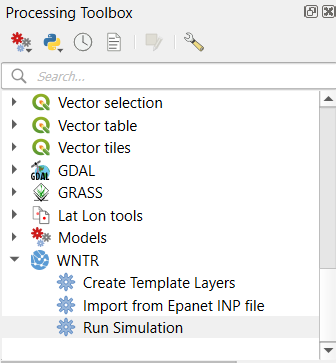
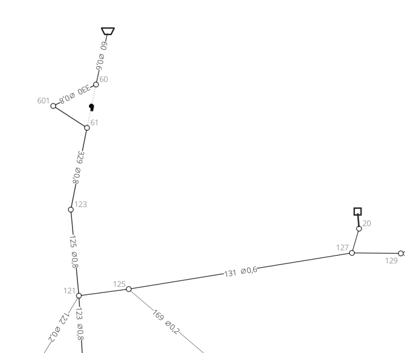
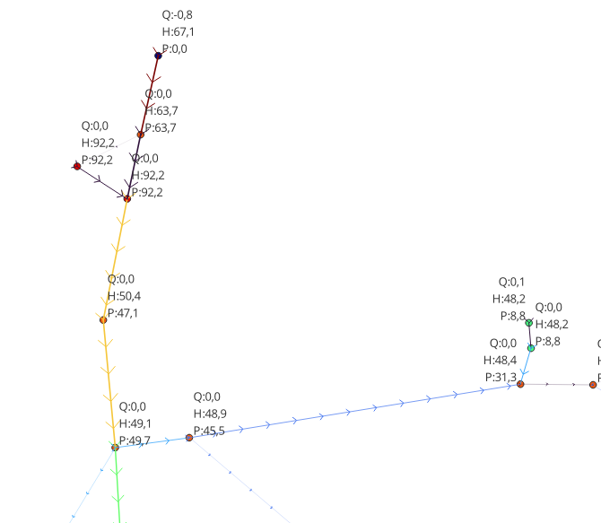

 

<!-- sphinx content start -->

# Water Network Tools for Resilience - QGIS Integration

This QGIS plugin integrates the US EPA's [Water Network Tools for Resilience (WNTR)](https://usepa.github.io/WNTR/) with [QGIS](https://qgis.org/).

A plugin for doing all aspects of piped water networks analysis directly within QGIS. This includes the creation of the model, the simulation and the visualisation of results.

It is compatible with and import/exports to EPANET. It uses the EPANET solver by default.

Compared to other QGIS water network modelling plugins, this plugin aims to be:
- **Easy to use.** Accessible for those who know how to use QGIS. Well documented, good defaults, clear functionality.
- **Integrate the power of QGIS and WNTR.** It aims to complement rather than replace features already within QGIS. Data can be manipulated with the standard QGIS tools, processing algorithms, and plugins.
- **Robust.** Limited, well tested features.
- **Flexible.** Not choosy about how you do things.
- **Automatable / programmable.** Tools can be used in the QGIS 'model builder' or from  PyQGIS

Feedback on this plugin would be very welcome.

<!-- sphinx content end -->

## Installation

Install the plugin in QGIS in the normal way (see the [QGIS Manual](https://docs.qgis.org/latest/en/docs/training_manual/qgis_plugins/fetching_plugins.html) if necessary). QGIS 3.34 or greater is required.

If WNTR is not already installed in the python environment, it will be installed within the plugin directory when first running the tools.

WNTR itself has some python dependencies. A warning will appear when running any of the algorithms from the 'processing toolbox' if there are missing dependencies.
* On *Windows* all dependencies are already included within QGIS.
* For *Linux / Mac* you will need to ensure that the following python packages are installed: Numpy, Scipy, Pandas, NetworkX,  Matplotlib and Geopandas. Exactly how to do this depends on your system and how you have installed QGIS.

## Usage

### Key Principles

WNTR will have created three new processing algorithms. If you can't see the processing toolbox activate it in the menu View -> Panels -> Processing Toolbox.

Whilst the plugin is very flexible in how it's used, the key principles are the following four steps:

1. **Layer Creation** Layers can either be created using the 'Create Template Layers' processing algorithm, or imported from EPANET files using the tools provided in the processing toolbox (or you can create them manually). If you are not sure where to start, type 'Net3.inp' into the 'Import from EPANET .inp file' algorithm. All of the layers are optional - only create what you need.
	- Junctions
	- Reservoirs
	- Tanks
	- Pipes
	- Pumps
	- Valves

2. **Layer Editing.** The layers are normal QGIS layers and can be edited / modified / processed / styled / automated in the same ways as any other QGIS layer. In particular:
   	- *Digitize* from any of the enormous range of data that QGIS can handle.
	- *Snapping tools* can be used when drawing the network to make sure that nodes and links connect.
	- *Pipe lengths* can be calculated automatically (this expression is added by default to new pipe layers).
	- *Elevations* can be added to nodes from other sources using either expressions or processing tools..
	- *External data sources* or any other layers can be used as background maps or data sources for drawing the network.

4. **Running the simulation.** The plugin will load your nodes, links, patterns, curves and options into WNTR and run the model It will then process the output into a new link and node layer containing all calculated results. Configure your analysis options to exploit the full power or WNTR and EPANET.

5. **Viewing the results.** Use all the power of QGIS to view and analyse your results.
   - Use all of QGIS's styling functions to look at all the results in nodes and links - pressure, flow, head, etc.
   - Use QGIS's temporal manager to view how your results change over time.

## Limitations
The plugin is currently marked as experimental. Some features which exist in WNTR / EPANET  are not yet implemented:
* Water quality analysis
* Controls
* Multiple demands per node.
* Patterns on valves

In addition, shapefile support is limited (due to a limitation of attribute length to 254 characters)

## License
This plugin is distributed under the terms of the [GNU General Public License, version 2](https://www.gnu.org/licenses/old-licenses/gpl-2.0.en.html) license.

See [LICENSE](LICENSE) for more information.
