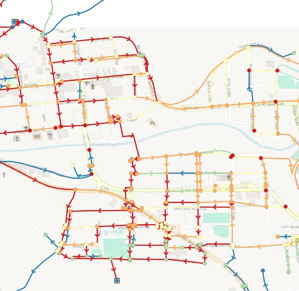

====================
Analysing Results
====================

Result Layers
=============

The results will be two layers, one for nodes (junctions, tanks and reservoirs) and one for links (pipes, pumps and valves).

The results at each node will be:

* Pressure
* Head
* Demand
* Quality (for water quality analysis)
* Reaction Rate (for water quality analysis)

The results at each link wil be:

* Flow
* Velocity
* Headloss (headloss gradient / unit headloss for pipes, or head change for valves and pumps)

The units for each parameter will be the same as the units set used for the model with which they were created.

The geometry of the output layer will be 'snapped' to the nodes that it was connected to during the analysis.

If the input layers had a 'name' attribute, these will feature in the outputs.

The output layers will be automatically styled to make interpretation of the results easy.

Viewing Results from Single Period Simulations
==============================================

By default a single period simulation will be run (i.e. the 'time' setting will be 0).

These appearance of the results can be controlled using the extensive QGIS layer styling options.

The QGIS 'Identify Features' tool is useful for querying the results at specific nodes or links. Alternatively, you can look at the ensemble of the results with the attribute table.

Viewing Results from Extended Period Simulation
===============================================

For an extended period simulation all result attributes will be 'list' types. Each value in the list corresponds to the value of that parameter at the corresponding timestep.

These can easily be viewed using the QGIS's 'temporal manager'.

The QGIS temporal manager uses real dates and times, whereas WNTR and EPANET provide a list of results with values at each timestep. In order to make these usable the output is configured by default to use the custom ``wntr_result_at_current_time( parameter )`` expression.
